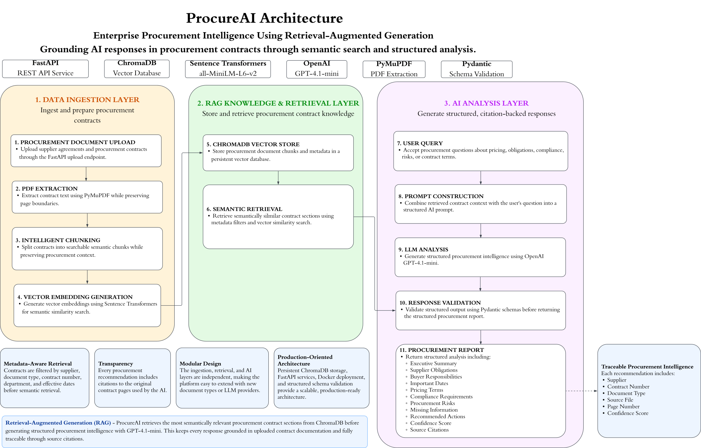
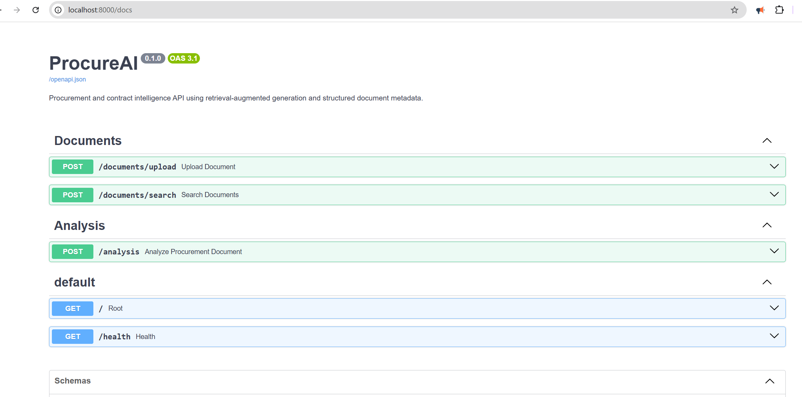
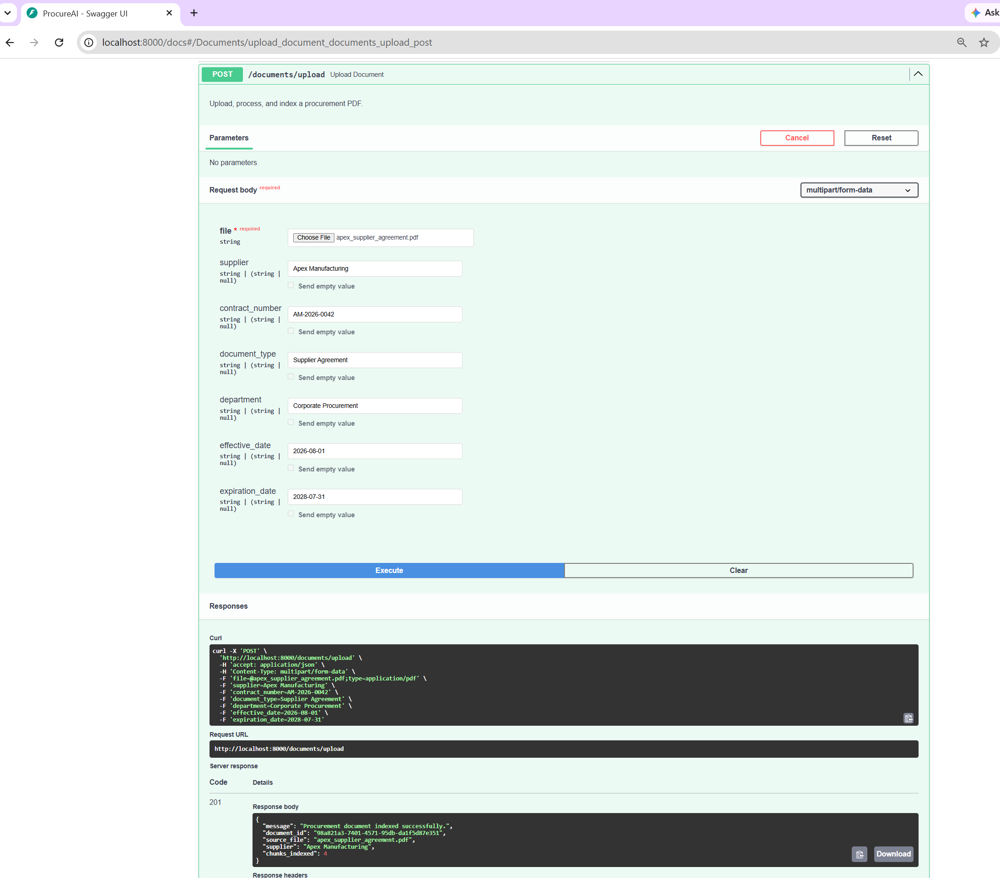
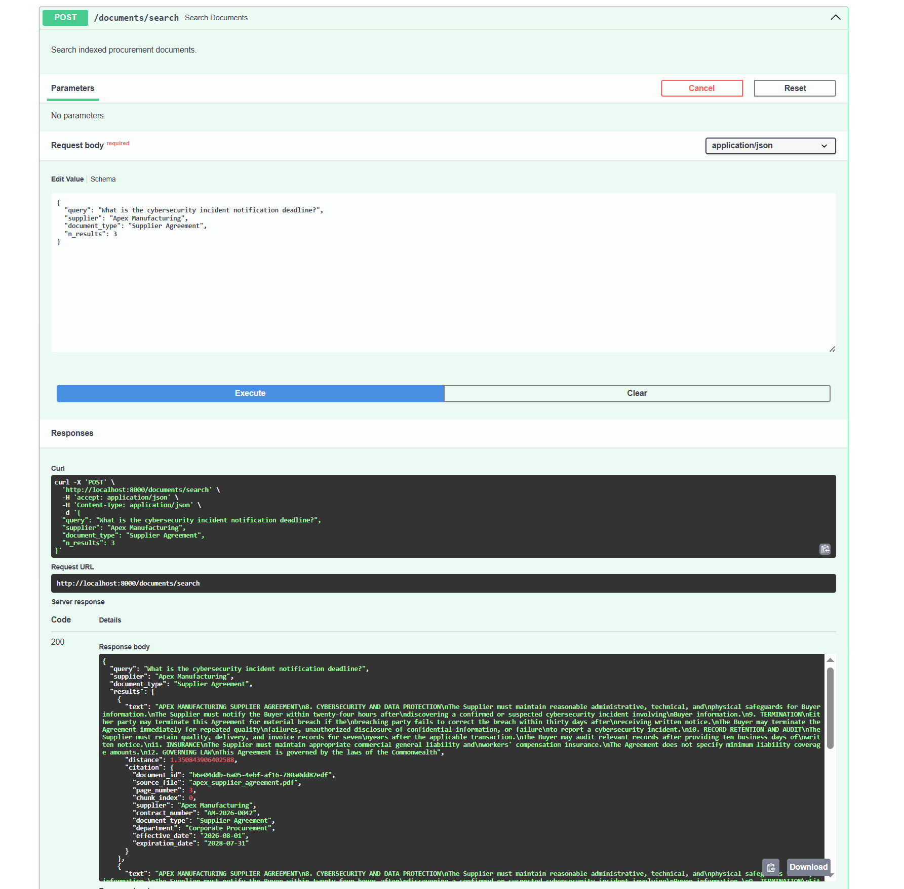
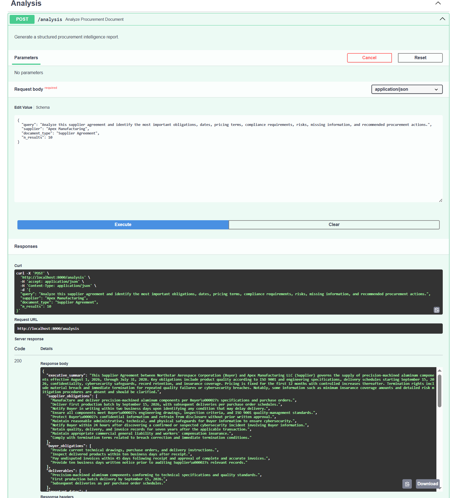

# ProcureAI


**AI-Powered Procurement Contract Intelligence using Retrieval-Augmented Generation (RAG)**

ProcureAI is a production-style artificial intelligence application that analyzes procurement contracts using Retrieval-Augmented Generation (RAG). The application combines semantic search, vector embeddings, metadata-aware retrieval, and OpenAI GPT-4.1-mini to generate grounded procurement intelligence while providing complete source traceability.

Designed as a portfolio project to demonstrate production AI engineering practices, ProcureAI showcases document ingestion, vector databases, semantic retrieval, REST API development, Docker deployment, and automated testing within a modular Python architecture.

---

## Table of Contents

- Why ProcureAI
- Architecture
- Key Features
- Technology Stack
- Application Demonstration
- Retrieval-Augmented Generation Workflow
- API Endpoints
- Running the Application
- Docker Deployment
- Testing
- Project Structure
- Design Principles
- Future Enhancements
- Portfolio Highlights
- Disclaimer

---

# Why ProcureAI

Procurement organizations spend significant time reviewing supplier agreements to identify contractual obligations, pricing terms, renewal dates, compliance requirements, and potential business risks.

Traditional keyword searches frequently miss relevant contract language because important clauses are often written using different terminology.

ProcureAI addresses this challenge by combining semantic search with Retrieval-Augmented Generation. Rather than relying solely on a language model, ProcureAI retrieves the most relevant contract sections from a vector database before generating an answer. This approach produces responses that remain grounded in the uploaded procurement documentation while providing traceable citations for every recommendation.

---

# Architecture

<p align="center">
  
</p>

### High-Level Architecture

1. Procurement documents are uploaded through the REST API.
2. PDF pages are extracted into text.
3. Text is intelligently divided into semantic chunks.
4. SentenceTransformer generates vector embeddings.
5. Chunks and metadata are indexed within ChromaDB.
6. User questions retrieve the most relevant contract sections.
7. Retrieved context is combined with a structured procurement prompt.
8. GPT-4.1-mini generates procurement intelligence.
9. Every response includes traceable source citations.

---

# Key Features

- AI-powered procurement contract analysis
- Retrieval-Augmented Generation (RAG)
- Semantic contract search
- Metadata-aware retrieval
- Supplier agreement intelligence
- Procurement risk identification
- Compliance requirement extraction
- Pricing and obligation analysis
- Structured AI responses
- Source citation generation
- Modular LLM provider architecture
- Docker deployment
- Persistent ChromaDB vector storage
- Comprehensive automated testing

---

# Technology Stack

| Category | Technology |
|-----------|------------|
| Language | Python 3.12 |
| API Framework | FastAPI |
| AI Model | OpenAI GPT-4.1-mini |
| Embeddings | SentenceTransformers |
| Vector Database | ChromaDB |
| Document Processing | PyMuPDF |
| Data Validation | Pydantic |
| Testing | Pytest |
| Deployment | Docker & Docker Compose |
| Server | Uvicorn |

---

# Application Demonstration

## Interactive REST API

ProcureAI exposes a fully documented FastAPI REST API that provides endpoints for document ingestion, semantic search, health monitoring, and AI-powered procurement analysis.

The interactive Swagger interface allows developers to test every endpoint directly from the browser without additional tooling.



---

## Procurement Document Ingestion

Supplier agreements are uploaded through the REST API together with structured metadata such as supplier name, contract number, department, document type, and effective dates.

During ingestion ProcureAI automatically:

- Extracts text from PDF pages
- Splits text into semantic chunks
- Generates vector embeddings
- Stores embeddings and metadata within ChromaDB

This creates a searchable procurement knowledge base that supports accurate semantic retrieval.



---

## Semantic Contract Retrieval

Rather than searching contracts using exact keywords, ProcureAI performs semantic similarity search.

User questions are converted into vector embeddings and compared against indexed contract embeddings within ChromaDB to retrieve the most relevant contract language.

Every retrieved result includes metadata such as:

- Supplier
- Contract title
- Source file
- Page number
- Similarity score

This retrieval layer ensures that AI responses remain grounded in actual contract language.



---

## AI-Powered Procurement Intelligence

Retrieved contract context is combined with a structured procurement prompt before being sent to GPT-4.1-mini.

The model generates a structured procurement report containing:

- Executive Summary
- Supplier Obligations
- Buyer Responsibilities
- Important Contract Dates
- Pricing Terms
- Compliance Requirements
- Procurement Risks
- Missing Information
- Recommended Procurement Actions
- Confidence Score
- Source Citations

Because every response is grounded in retrieved contract sections, ProcureAI minimizes hallucinations while maintaining transparency through traceable citations.



---

# Retrieval-Augmented Generation Workflow

```text
                Procurement Contract
                        │
                        ▼
               PDF Text Extraction
                        │
                        ▼
               Intelligent Chunking
                        │
                        ▼
        SentenceTransformer Embeddings
                        │
                        ▼
            ChromaDB Vector Database
                        │
                        ▼
              User Procurement Query
                        │
                        ▼
             Semantic Similarity Search
                        │
                        ▼
            Retrieved Contract Context
                        │
                        ▼
      Structured Procurement Prompt Builder
                        │
                        ▼
                 GPT-4.1-mini Analysis
                        │
                        ▼
         Grounded Procurement Intelligence
               with Source Citations
```

ProcureAI follows a Retrieval-Augmented Generation (RAG) architecture rather than allowing the language model to answer from general knowledge alone.

For every request, relevant contract sections are retrieved first and supplied to the model as context. This architecture improves factual accuracy while allowing every generated insight to be traced back to the original procurement documentation.

---

# API Reference

| Method | Endpoint | Description |
|---------|----------|-------------|
| `GET` | `/` | Application information |
| `GET` | `/health` | Health check |
| `POST` | `/documents/upload` | Upload and index procurement contracts |
| `POST` | `/documents/search` | Semantic contract retrieval |
| `POST` | `/analysis` | AI-powered procurement analysis |

---

# Running the Application

ProcureAI can be run using either a local Python environment or Docker.

---

## Option 1 — Local Development

### 1. Clone the Repository

```bash
git clone https://github.com/AnthonySotoData/ProcureAI.git
cd ProcureAI
```

### 2. Create a Virtual Environment

```bash
python -m venv .venv
```

Activate the environment:

**Windows PowerShell**

```powershell
.venv\Scripts\Activate.ps1
```

**macOS / Linux**

```bash
source .venv/bin/activate
```

---

### 3. Install Dependencies

```bash
pip install -r requirements.txt
```

---

### 4. Configure Environment Variables

Create a `.env` file in the project root.

Example:

```text
OPENAI_API_KEY=your_openai_api_key
OPENAI_MODEL=gpt-4.1-mini
LLM_PROVIDER=openai
```

To run the application without an OpenAI API key, use:

```text
LLM_PROVIDER=mock
```

---

### 5. Start the Application

```bash
uvicorn src.main:app --reload
```

Open the interactive API documentation:

```text
http://localhost:8000/docs
```

---

# Option 2 — Docker Deployment

If Docker Desktop is installed, ProcureAI can be started with a single command.

Build and launch the application:

```bash
docker compose up --build
```

Once the containers have started, open:

```text
http://localhost:8000/docs
```

Docker automatically creates the application environment and persists ChromaDB data between container restarts using Docker volumes.

---

# Testing

Run the automated test suite:

```bash
pytest
```

Current project status:

- 35 automated tests passing
- API endpoint validation
- PDF ingestion testing
- Retrieval logic testing
- Prompt generation testing
- Vector database testing
- Provider factory testing
- Analysis service testing
- Error handling validation

---

# Project Structure

```text
ProcureAI/
│
├── data/
├── images/
├── scripts/
├── src/
│   ├── api/
│   ├── config/
│   ├── ingestion/
│   ├── llm/
│   ├── models/
│   ├── rag/
│   └── services/
│
├── tests/
│
├── Dockerfile
├── docker-compose.yml
├── requirements.txt
├── README.md
├── .gitignore
└── .env.example
```

---

# Design Principles

ProcureAI was designed around modern AI engineering best practices.

Core design principles include:

- Retrieval-Augmented Generation (RAG)
- Ground AI responses in retrieved contract context
- Maintain complete source traceability
- Separate ingestion, retrieval, analysis, and API layers
- Validate structured outputs using Pydantic
- Support interchangeable LLM providers
- Package the application with Docker for reproducible deployment
- Maintain comprehensive automated testing

---

# Future Enhancements

Potential future improvements include:

- Multi-document procurement analysis
- Supplier contract comparison
- Clause classification using machine learning
- Procurement risk scoring
- Contract expiration notifications
- Authentication and role-based access control
- Cloud deployment
- Interactive web dashboard
- Background document processing
- Support for additional document formats

---

# Portfolio Highlights

ProcureAI demonstrates practical experience with:

- Retrieval-Augmented Generation (RAG)
- FastAPI application development
- Vector databases
- Semantic search
- OpenAI API integration
- Prompt engineering
- PDF document processing
- Docker deployment
- Automated testing
- Modular software architecture
- Production-oriented AI application design

---

# Disclaimer

ProcureAI is an original portfolio project developed to demonstrate modern AI engineering and software development practices.

The included procurement documents are synthetic examples created for demonstration purposes only and should not be interpreted as legal or contractual guidance.

# License

This project is licensed under the MIT License. See the LICENSE file for details.